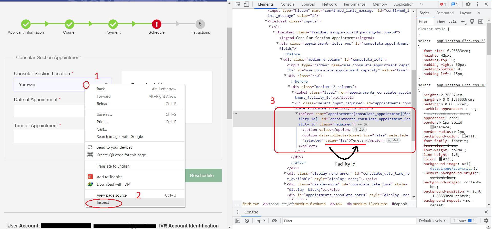

# U.S. Visa Appointment Finder

An automation tool that monitored the U.S. visa appointment calendar for the U.S. Embassy in Nairobi and attempted to move an existing appointment into an earlier date window. I built it because my visa appointment was on the same day my classes started, and the scheduling website did not provide an automatic way to watch for newly released slots.

This project is a personal automation experiment, not an official U.S. government service. Use it only with an account and appointment that you are authorized to manage, and review the scheduling service's terms before automating requests.

## Demo

The scheduling site requires an authenticated account, so a public live demo is not practical. The repository includes dated log files showing the monitoring output. A typical run looks like this:

```text
Request count: 1, Log time: 2024-06-24 10:00:00
Available dates: 2024-07-08, 2024-07-15
Got time successfully! 2024-07-08 08:00
Sending notification!
```

## Screenshot: finding a facility ID

The appointment page exposes the consular location and facility ID in its HTML. I used Chrome DevTools to inspect the location selector and confirm the numeric value before adding it to `embassy.py`.



To repeat this process, open the appointment page, choose **Inspect**, find the location `<select>`, and read the selected `<option>` value. Facility IDs and page markup can change, so this is a validation step rather than a permanent source of truth.

## Key features

- Automates Chrome sign-in with Selenium.
- Checks appointment availability through the authenticated scheduling endpoints.
- Filters dates against a configured start and end date.
- Attempts to reschedule to the first matching date and an available time.
- Writes request results and errors to daily `log_YYYY-MM-DD.txt` files.
- Supports optional notifications through SendGrid, Pushover, a personal HTTP endpoint, or AWS SNS.
- Supports local Chrome or a remote Selenium WebDriver.
- Includes an embassy configuration table that can be extended for other supported locations.
- Uses randomized retry intervals, work cooldowns, and a longer pause after an empty response to reduce unnecessary requests.

## Technologies

- Python 3.10+ (the code uses structural pattern matching)
- Selenium and Chrome WebDriver
- `requests` for authenticated HTTP requests
- `configparser` for local configuration
- SendGrid, Pushover, and AWS SNS notification integrations
- AWS SDK for Python (`boto3`) when SNS notifications are enabled

## Installation

This repository is currently a script-based project and does not include `pyproject.toml` or `setup.py`, so `pip install -e .` is not available yet. Install the dependencies directly:

```bash
git clone <repository-url>
cd US-Visa-Appointment-Finder
python -m venv .venv
```

Activate the virtual environment:

```bash
# Windows PowerShell
.\.venv\Scripts\Activate.ps1

# macOS/Linux
source .venv/bin/activate
```

Install the pinned dependencies:

```bash
python -m pip install --upgrade pip
python -m pip install requests==2.27.1 selenium==4.2.0 webdriver-manager==3.7.0 sendgrid==6.9.7 boto3
```

Google Chrome must also be installed. With `LOCAL_USE = True`, Selenium uses the locally installed Chrome driver. For a remote browser, set `LOCAL_USE = False` and configure `HUB_ADDRESS` in `config.ini`.

## Configuration

1. Copy the configuration file for local use:

   ```powershell
   Copy-Item config.ini config.local.ini
   ```

2. Edit the local configuration with:

   - `USERNAME` and `PASSWORD`: the scheduling account credentials.
   - `SCHEDULE_ID`: the ID from the appointment rescheduling URL.
   - `PRIOD_START` and `PRIOD_END`: the target date window, using `YYYY-MM-DD`.
   - `YOUR_EMBASSY`: an entry from `embassy.py`; the Nairobi entry is `en-ke`.
   - Notification credentials and endpoints, if notifications are needed.
   - Retry and cooldown values in the `[TIME]` section.

3. Keep credentials out of Git. The committed `config.ini` must contain placeholders only, and should be listed in `.gitignore` in a production-ready version. Any credentials that have already been committed or shared should be rotated before publishing the repository.

The Nairobi facility is currently defined in `embassy.py` as facility ID `104`. Facility IDs and website selectors can change, so verify them against the current scheduling flow before running the tool.

### Finding a facility ID

1. Sign in to the scheduling website and open the rescheduling page.
2. Inspect the consular location dropdown in Chrome DevTools.
3. Find the `<option>` for the desired embassy and copy its `value` attribute.
4. Update the matching entry in `embassy.py` and confirm the regional URL code and localized Continue label.

The included screenshot documents the exact inspection technique used during development. It shows a Yerevan example from the broader embassy configuration, while the active project configuration targets Nairobi.

## Running the project

After activating the virtual environment and configuring the account:

```bash
python visa.py
```

The script opens Chrome, signs in, checks for available dates, and keeps polling until it finds a date in the configured window or encounters an exception. It then attempts the reschedule, sends the configured notification, logs out, and closes the browser.

To stop the process, use `Ctrl+C` and then verify that the browser session is closed. Start with a broad date window and notifications disabled while validating the login and selectors. Do not run multiple copies against the same account.

## Project structure

```text
.
├── visa.py                 # Selenium workflow, availability checks, rescheduling, and notifications
├── embassy.py              # Embassy codes, facility IDs, and localized Continue labels
├── config.ini              # Local credentials and runtime settings; keep private
├── esender.php             # Optional server-side email endpoint
├── nsstest.py              # Small AWS SNS publishing experiment
├── req_installer.bat       # Windows dependency installation helper
└── log_YYYY-MM-DD.txt     # Runtime logs generated by the monitor
```

## Technical design

The main workflow is deliberately small and stateful:

1. `configparser` loads account, embassy, notification, and timing settings.
2. Selenium opens the correct regional sign-in page and keeps the authenticated browser session alive.
3. JavaScript executed inside that session requests the appointment dates and times, preserving the site's session cookie.
4. `get_available_date()` filters returned dates against the configured target period.
5. `reschedule()` submits the selected facility, date, and time with the page's authenticity token.
6. `send_notification()` fans the result out to whichever notification providers are configured.

Using the browser session for the availability requests was important because the endpoints require authentication. Separating embassy metadata into `embassy.py` also keeps regional URL fragments and facility IDs out of the main workflow.

## Challenges and lessons learned

- Authenticated availability endpoints required the same browser session and cookies as the interactive website.
- Selenium timing mattered: page elements and login completion were handled with explicit waits instead of assuming an immediate response.
- Appointment availability is transient, so the script needed bounded polling intervals, randomized delays, and cooldown behavior.
- Notification delivery had to remain optional so the core monitor could be tested without external services.
- Configuration and secrets are operational concerns, not just code concerns. A future version should use environment variables or a secrets manager instead of a credential-bearing INI file.

## Deployment and operations notes

The project also provided a practical introduction to running a polling workload outside a local laptop. The main lessons were:

- Containerize the script and publish images through Amazon ECR for repeatable deployments.
- Use ECS Fargate or a scheduled EventBridge task when an always-on server is unnecessary.
- Store account credentials and notification tokens in AWS Secrets Manager or SSM Parameter Store instead of the repository.
- Centralize logs in CloudWatch Logs and monitor failures, notification delivery, and repeated empty responses.
- Use least-privilege IAM permissions for SNS publishing and secret access.
- Treat retry intervals, cooldown periods, and jitter as both reliability and cost controls.
- Capture deployment settings in CloudFormation or Terraform when the service needs to be recreated consistently.

The current repository includes the AWS SNS notification experiment in `nsstest.py`; the other deployment items are operational directions for a production-ready version rather than prerequisites for running the local script.

## Limitations and future improvements

- The script depends on the scheduling site's current HTML structure, endpoints, cookies, and anti-automation behavior.
- It currently attempts a reschedule automatically; a safer design would default to notification-only mode and require explicit confirmation before submitting a change.
- There is no automated test suite, type checking, structured logging, or dependency lock file.
- Error handling can be improved with provider-specific timeouts, retry policies, and clearer recovery states.
- Configuration should be migrated to environment variables or a secret store, and sensitive values should never be committed.
- A future packaging pass could add `pyproject.toml`, a `--once` dry-run mode, and a small testable service layer around date selection and notification dispatch.

## Testing

Testing was primarily manual because the live scheduling flow requires a real authenticated account and an active appointment:

```bash
python -m py_compile visa.py embassy.py nsstest.py
python visa.py
```

Before enabling rescheduling, verify Chrome startup, login, date parsing, logging, and notification delivery with a non-destructive account configuration. Do not use production credentials in automated tests.

## License

This project is licensed under the MIT License. See [LICENSE](LICENSE).

## Contact

Maintainer: Naeem Chaker

For professional use, replace this line with your preferred GitHub, LinkedIn, or portfolio URL.